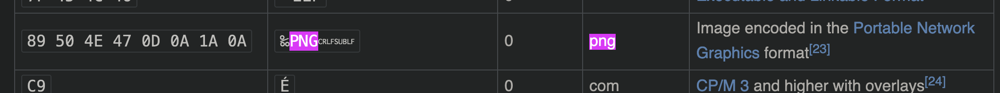

# desctipion

your givin a simplified code in source.txt

```
from PIL import Image
from itertools import cycle

def xor(a, b):
    return [i^j for i, j in zip(a, cycle(b))]

f = open("original.png", "rb").read()
key = [f[0], f[1], f[2], f[3], f[4], f[5], f[6], f[7]]

enc = bytearray(xor(f,key))

open('enc.txt', 'wb').write(enc)
```

reading the code, we see that the script opens a png file and then xor it with the first 8 byte of the file itself

# solution

the first 8 bytes of a png file is it's file siqnature, a quick search we can [find it](https://en.wikipedia.org/wiki/List_of_file_signatures)



then the rest is easy, we just xor the cipher with the key (png signature) to reverse and recover the original img

script used:
```py
from itertools import cycle

enc = open("enc.txt", "rb").read()

key = [0x89, 0x50, 0x4e, 0x47, 0x0d, 0x0a, 0x1a, 0x0a]

def xor(a, b):
    return [i^j for i, j in zip(a, cycle(b))]

dec = bytearray(xor(enc, key))

open('dec.png', 'wb').write(dec)
```

